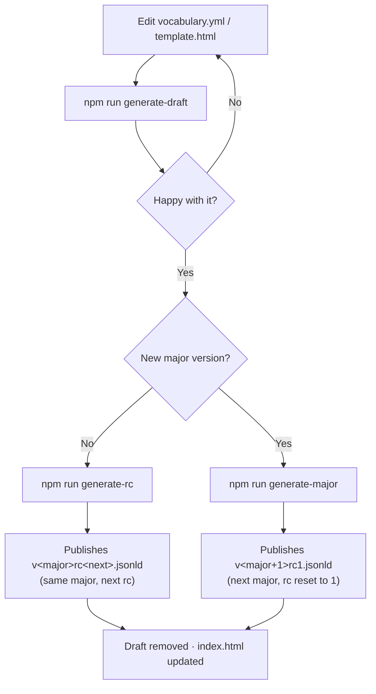

# Generating the JSON-LD Context

The JSON-LD context is auto-generated from `vocabulary.yml` using
[`yml2vocab`](https://github.com/w3c/yml2vocab), which emits
`vocabulary.context.jsonld`; the build then places it under `contexts/` as
`v<major>rc<N>.jsonld`. Do not hand-edit the context file or `index.html` —
edit the YAML (or `template.html`) and regenerate.

## Prerequisites

- Node.js >= 21
- Install dependencies (pulls in `yml2vocab` as a devDependency):

```bash
npm install
```

## Usage (Generate Context)

Everything runs through three npm scripts (each one generates, places the files
in their final locations, and cleans up).

### Iterate

After each change to `vocabulary.yml` or `template.html`, regenerate the draft:

```bash
npm run generate-draft
```

Run it as many times as you like. Each run overwrites the same draft file, so
the already-published context is never touched.

Then publish it one of two ways — as the next release candidate, or as a new
major version.

### Cut a release candidate

Once the revision is final, run this once to publish it
(`rc` = release candidate):

```bash
npm run generate-rc
```

**Naming.**

- Stays on the highest existing major and increments the rc.
- With `v1rc1.jsonld` published, the draft is `contexts/v1rc2-draft.jsonld`
and this publishes `contexts/v1rc2.jsonld` (dropping `-draft`).

### Cut a new major

To start the next major version instead of another rc:

```bash
npm run generate-major
```

**Naming.**

- Advances the major and resets the rc counter to 1 — e.g. `v1rc5.jsonld` ->
`contexts/v2rc1.jsonld`.
- This is the only command that changes the major; `generate-draft` and
`generate-rc` always stay on the highest existing major.

> With nothing published yet, the first target is `v1rc1.jsonld` in either path.

### Flow



### Example — developing v1rc2.jsonld (v1rc1.jsonld already published)

Starting point:

```
# already published
contexts/
  v1rc1.jsonld
```

1. Add terms to `vocabulary.yml`, then run `npm run generate-draft`:

```
contexts/
  v1rc1.jsonld
  # new draft, index.html updated
  v1rc2-draft.jsonld
```

2. Need more changes? Edit `vocabulary.yml` and run `npm run generate-draft`
  again — it overwrites the same `v1rc2-draft.jsonld`. Repeat as needed.

3. Happy with it? Run `npm run generate-rc`:

```
contexts/
  v1rc1.jsonld
  # release candidate (draft removed)
  v1rc2.jsonld
```

The next rc starts the same way (`generate-draft` -> `v1rc3-draft.jsonld`). To
instead start a new major, run `npm run generate-major`, which would publish
`v2rc1.jsonld`.

### Under the hood

- Each script runs `yml2vocab -v vocabulary.yml -t template.html -c` then
`node scripts/postgenerate.js` (with `--rc` or `--major` to publish).
- Flags: `-v` vocab file, `-t` template, `-c` emit the context; add `-d` for
a full error stack.
- Both publish modes also render the docs to `index.html` and delete the
unused `vocabulary.ttl` / `vocabulary.jsonld` outputs.

### Manual (without the npm scripts)

If you need to run the tool directly, from the **retail-dw-vocabulary root**:

```bash
npx yml2vocab -v vocabulary.yml -t template.html -c
```

Flags: `-v` vocab file, `-t` HTML template, `-c` emit the JSON-LD context.
Add `-d` for a full error stack if it fails.

This writes raw outputs to the current directory — `vocabulary.context.jsonld`
(the context), plus `vocabulary.ttl`, `vocabulary.jsonld`, and
`vocabulary.html` — and does **not** place them. You then do what the scripts
would otherwise automate:

- Move `vocabulary.context.jsonld` into `contexts/` as `v<major>rc<N>.jsonld`;
  use a `-draft` suffix while iterating; drop it to publish
  (see the naming under **Cut a release candidate** / **Cut a new major**
  above).
- Update the published docs from `vocabulary.html`: copy its contents into
  `index.html`, or delete `index.html` and rename `vocabulary.html` to it.
- Delete the unused `vocabulary.ttl` and `vocabulary.jsonld`.

## Adding new terms

Edit `vocabulary.yml` — classes under `class:`, properties under `property:` —
then regenerate. Keep each term's `context:` value pointing at the current
context version (currently `https://w3id.org/retail-dw/v1rc1`). If you cut a
new revision, update these to match.

## Abstract, introduction, and shortName (template.html)

These are hardcoded directly in `template.html`. `yml2vocab` has no
`dc:abstract` handling and does not process `{{...}}` placeholders, so it
cannot fill them from the YAML. Edit the abstract/introduction/shortName in
`template.html` — never in the generated `index.html`, which is overwritten on
every run.

## Indentation (.editorconfig)

`yml2vocab` pretty-prints the context at **indent size 4** by default. To keep
this repo's context at **2-space** indentation, an `.editorconfig` is included
in the repo root. `yml2vocab` reads it from the directory the command is run in
at generation time, so keep it there and run the command from the repo root.

`.editorconfig`:

```ini
root = true

[*]
indent_style = space
indent_size = 2
```
